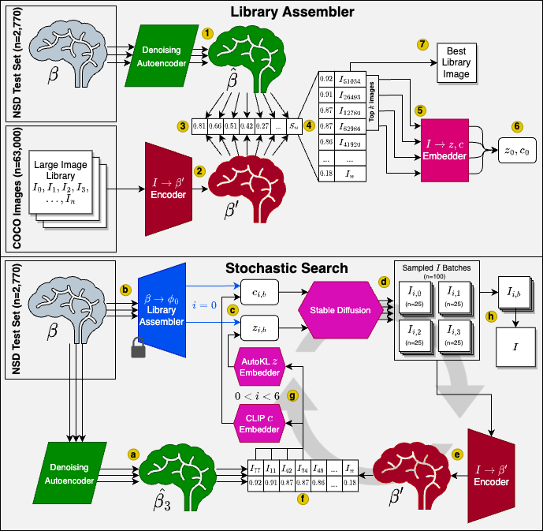

# Second Sight: Using brain-optimized encoding models to align image distributions with human brain activity

<div align=center>

</div>
<br/>
<div align=center>
<a src="https://img.shields.io/badge/%F0%9F%93%96-Arxiv_2306.00927-red.svg?style=flat-square" href="https://arxiv.org/abs/2306.00927">
</a>
<a src="https://img.shields.io/badge/%20-%20Project%20Website%20-%20" href="https://www.reesekneeland.com/second-sight">

</a>
<a src="https://img.shields.io/badge/%F0%9F%A4%97-Open_in_Spaces-informational.svg?style=flat-square" href="https://huggingface.co/reesekneeland/Second-Sight/tree/main">


</a>

</div>

## Installation instructions
This repository requires at least an NVIDIA A100 40GB GPU. 
1. Download this repository:
 ```
 git clone https://github.com/reesekneeland/Second-Sight.git
``` 

2. Create and activate conda environment:
```
cd Second-Sight
conda env create -f environment.yml
conda activate SS
```

3. Perform setup steps via our automation script, to run on all subjects with no local copy of the Natural Scenes Dataset use the following command. This procedure, which downloads the data, processes it, trains the models, and encodes the training images collectively takes ~5 hours on an A100.
```
python src/run.py --downloadnsd --subjects 1

options:
  -h, --help            show this help message and exit
  -d, --downloadnsd     flag to download the NSD data via AWS, requires aws command to be configued. If not set, assumes that the required NSD files are present under the data/ directory (default: False)
  -t, --train           flag to train models from scratch, will only download the gnet model, and train all others from scratch. If flag is not set it will download all pretrained models. (default: False)
  -s SUBJECTS, --subjects SUBJECTS
                        list of subjects to run the algorithm on, if not specified, will run on all subjects (default: 1,2,5,7)
  --device DEVICE       cuda device to run predicts on. (default: cuda)

```
## Alternative Installation Options
Instead of using the main automation script provided above, you can perform the various setup and configuration steps individually using the scripts below. This is useful if you want to set up custom training configurations and have more control over the data processing procedures.

1. Aquire a copy of the Natural Scenes Dataset, you can download the relevant files for this project using aws via our setup script below, or by downloading/moving your own copy to the ```/data``` directory. To download your own copy, start by agreeing to the Natural Scenes Dataset's [Terms and Conditions](https://cvnlab.slite.page/p/IB6BSeW_7o/Terms-and-Conditions) and fill out the [NSD Data Access form.](https://forms.gle/xue2bCdM9LaFNMeb7)
```
python data/download_nsddata.py

options:
  -h, --help            show this help message and exit
  -s SUBJECTS, --subjects SUBJECTS
                        list of subjects to download models for, if not specified, will run on all subjects (default: 1,2,5,7)
```


2. You can skip training Second Sight yourself and instead run the rest of the notebooks on Subject 1 of NSD by downloading our pre-trained models available on [huggingface](https://huggingface.co/reesekneeland/Second-Sight/tree/main) and putting these model checkpoints inside the ```models``` folder, or by running our download script below to perform this step automatically. The pretrained GNet model is utilized in this work, and so must be downloaded, however the remaining models can be trained from scratch in steps 4 and 6:
```
python data/download_weights.py

options:
  -h, --help            show this help message and exit
  --gnet                flag to download only the GNet model (1.18GB) but you will be required to train the other models, otherwise all models will be downloaded (14GB) (default: False)
  -s SUBJECTS, --subjects SUBJECTS
                        list of subjects to download models for, if not specified, will run on all subjects (default: 1,2,5,7)
```

3. Process the brain data and encode the dataset images into their CLIP vectors and VDVAE latents via our setup script:
```
python data/setup_data.py

options:
  -h, --help            show this help message and exit
  -s SUBJECTS, --subjects SUBJECTS
                        list of subjects to run the algorithm on, if not specified, will run on all subjects (default: 1,2,5,7)
  -d DEVICE, --device DEVICE
                        cuda device to run predicts on. (default: cuda)
```

4. Train the CLIP Encoding model, if not downloading the pretrained model.
```
python src/clip_encoder.py

options:
  -h, --help            show this help message and exit
  --subjects SUBJECTS   list of subjects to train models for, if not specified, will run on all subjects (default: 1,2,5,7)
  --batch_size BATCH_SIZE
                        Batch size for training (default: 750)
  --log LOG             whether to log to wandb (default: False)
  --num_epochs NUM_EPOCHS
                        number of epochs of training (default: 200)
  --lr LR
  --num_workers NUM_WORKERS
  --device DEVICE
  --benchmark BENCHMARK
                        run benchmark on each encoder model after it finishes training. (default: True)
```

5. Use the encoding models to generate beta primes for the images in NSD
```
python src/generate_beta_primes.py

options:
  -h, --help            show this help message and exit
  -s SUBJECTS, --subjects SUBJECTS
                        list of subjects to run the algorithm on, if not specified, will run on all subjects (default: 1,2,5,7)
  -d DEVICE, --device DEVICE
                        cuda device to run predicts on. (default: cuda:0)
```


6. Use the encoded beta primes to train the AutoEncoder models:
```
python src/autoencoder.py

options:
  -h, --help            show this help message and exit
  --subjects SUBJECTS   list of subjects to train models for, if not specified, will run on all subjects (default: 1,2,5,7)
  --configs CONFIGS     list of autoencoder configs to train models for, if not specified, will run on all configs (default: gnet,clip,hybrid)
  --batch_size BATCH_SIZE
                        Batch size for training (default: 64)
  --log LOG             whether to log to wandb (default: False)
  --num_epochs NUM_EPOCHS
                        number of epochs of training (default: 200)
  --lr LR
  --num_workers NUM_WORKERS
  --device DEVICE
  --benchmark BENCHMARK
                        run benchmark on each autoencoder model after it finishes training. (default: True)
```

## Inference
Once the setup process is complete, you can generate predictions on indices from the NSD shared1000 test set using the following command. Inference for this algorithm can be quite expensive, with computation times amounting to ~30m per sample on an A100, or around 17 days to generate predictions for the whole test set.
```
python src/second_sight.py

options:
  -h, --help            show this help message and exit
  --output OUTPUT       output directory for the generated samples (default: output/)
  --idx IDX             list of indicies to be generated for each subject. (default: See the provided indices in data/test_indices.txt)
  -l, --log             boolean flag, if passed, will save all intermediate images for each iteration of the algorithm, as well as intermediate encoded brain scans. WARNING: This saves a lot of data, only enable if you
                        have terabytes of disk space to throw at it. (default: False)
  --noae                boolean flag, if passed, will use original betas instead of the denoised betas passed through an autoencoder as the search target (default: False)
  -s SUBJECTS, --subjects SUBJECTS
                        list of subjects to run the algorithm on, if not specified, will run on all subjects (default: 1,2,5,7)
  -n NUM_SAMPLES, --num_samples NUM_SAMPLES
                        number of library images generated at every interation of the algorithm. (default: 100)
  -i ITERATIONS, --iterations ITERATIONS
                        number of interations for the search algorithm. (default: 6)
  -b BRANCHES, --branches BRANCHES
                        number of additional suboptimal paths to explore during the search. (default: 4)
  --device DEVICE
```

## General information

This repository contains scripts for 

1. Training the required models for Second Sight (```src/clip_encoder.py```, ```src/autoencoder.py```)
2. Reconstructing images from brain activity using the model architecture (```src/second_sight.py```)
3. Evaluating reconstructions against the ground truth images according to low- and high-level image metrics (**TODO**) 


# Citation

If you make use of this work please cite both the Second Sight paper and the Natural Scenes Dataset paper.

```bibtex
@misc{kneeland2023second,
      title={Second Sight: Using brain-optimized encoding models to align image distributions with human brain activity}, 
      author={Reese Kneeland and Jordyn Ojeda and Ghislain St-Yves and Thomas Naselaris},
      year={2023},
      eprint={2306.00927}
}

@article{Allen_2021_NSD, 
      title={A massive 7T fmri dataset to Bridge Cognitive Neuroscience and artificial intelligence}, 
      volume={25}, 
      DOI={10.1038/s41593-021-00962-x}, 
      number={1}, 
      journal={Nature Neuroscience}, 
      author={Allen, Emily J. and St-Yves, Ghislain and Wu, Yihan and Breedlove, Jesse L. and Prince, Jacob S. and Dowdle, Logan T. and Nau, Matthias and Caron, Brad and Pestilli, Franco and Charest, Ian and et al.}, 
      year={2021}, 
      pages={116–126}
} 
```